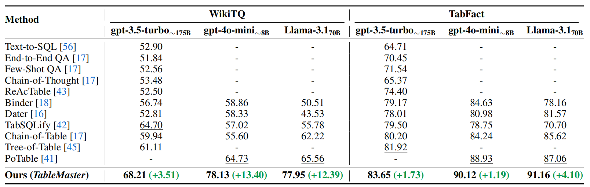

# Awesome-Table-Reasoning-with-Compression
This repository focuses on table reasoning methods with table compression. For more general data-centric AI approaches, please refer to [SJTU-DMTai/awesome-ml-data-quality-papers](https://github.com/SJTU-DMTai/awesome-ml-data-quality-papers/blob/main/README.md) and [KyranFang/Awesome-Paper-for-DCAI-in-Tabular-Data](https://github.com/KyranFang/Awesome-Paper-for-DCAI-in-Tabular-Data). 

## Background & Definition

Table reasoning focuses on enabling models to understand and reason over structured tabular data to perform tasks such as question answering, fact verification, and text generation. There are two main approaches：

- One involves carefully designed prompt engineering, leveraging large language models combined with tool calls like Python, SQL to address
  tasks;
- The other approach uses fine-tuning with table-specific data to enable models to understand tables.

There are several challenges for LLMs to reason over tables:

- Some tables are too large to fit in the context of LLMs;
- When the length of tables grows, models are hard to capture and reason about all the necessary information.
- The diversity of table structure and heterogeneous among rows and columns.
- Ambiguity of table content.

Thus, many researchers try to avoid input entire table into LLMs' context to reason by some specially designed methods, e.g.:

- Decompose or extract the entire table into sub-tables, and choose relevant sub-tables. This includes [[Dater, SIGIR'23]](https://dl.acm.org/doi/10.1145/3539618.3591708), [[ITR, ACL'23]](https://aclanthology.org/2023.acl-long.551/), [[TAP4LLM, EMNLP'24 findings]](https://aclanthology.org/2024.findings-emnlp.603/), [[TableRAG, NIPS'24]](https://proceedings.neurips.cc/paper_files/paper/2024/file/88dd7aa6979e352fda7c4952ca8eac59-Paper-Conference.pdf), [[TabSQLify, NAACL'24]](https://aclanthology.org/2024.naacl-long.320/), [[Tree-of-Table, arXiv'24]](https://arxiv.org/abs/2411.08516), [[PoTable, arXiv'24]](https://arxiv.org/abs/2412.04272), [[TableMaster, arXiv'25]](https://arxiv.org/abs/2501.19378).
- Before reasoning process, LLMs iteratively generates intermediate tables, then reason. This includes [[TableKV, ACL'25 TRL workshop]](https://aclanthology.org/2025.trl-1.13/), [[Chain-of-Table, ICLR'24]](https://openreview.net/forum?id=4L0xnS4GQM), [[Tree-of-Table, arXiv'24]](https://arxiv.org/abs/2411.08516).

> Note: Our definition of table reasoning explicitly requires the last answer to be generated by LLMs (may with the help of intermediate states), tasks like Text2SQL are NOT included in this domain.

## Benchmarks

Extent from [KyranFang/Awesome-Paper-for-DCAI-in-Tabular-Data](https://github.com/KyranFang/Awesome-Paper-for-DCAI-in-Tabular-Data).

### Latest Benchmarks for Tabular Data (Since 2024)

| Benchmark Name |   Task Type   | Year |                            Source                            | TLDR                                                         |
| :------------: | :-----------: | :--: | :----------------------------------------------------------: | :----------------------------------------------------------- |
|    MDBench     |   Reasoning   | 2025 |         [[Link]](https://github.com/jpeper/MDBench)          | MDBench introduces a new multi-document reasoning benchmark synthetically generated through knowledge-guided prompting. |
|      MMQA      |   Reasoning   | 2025 | [[Link]](https://openreview.net/pdf?id=GGlpykXDCa)  [[Repo]](https://github.com/WuJian1995/MMQA/issues/2) | MMQA is a multi-table multi-hop question answering dataset with 3,312 tables across 138 domains, evaluating LLMs' capabilities in multi-table retrieval, Text-to-SQL, Table QA, and primary/foreign key selection. |
|      ToRR      |   Reasoning   | 2025 | [[Link]](https://arxiv.org/pdf/2502.19412)  [[Repo]](https://github.com/IBM/unitxt/blob/main/prepare/benchmarks/torr.py) | ToRR is a benchmark assessing LLMs' table reasoning and robustness across 10 datasets with diverse table serializations and perturbations, revealing models' brittleness to format variations. |
|      MMTU      | Comprehensive | 2025 | [[Link]](https://arxiv.org/pdf/2506.05587)  [[Repo]](https://github.com/MMTU-Benchmark/MMTU) | MMTU is a massive multi-task table understanding and reasoning benchmark with over 30K questions across 25 real-world table tasks, designed to evaluate models' ability to understand, reason, and manipulate tables. |
|     RADAR      |   Reasoning   | 2025 | [[Link]](https://kenqgu.com/assets/pdf/RADAR_ARXIV.pdf)  [[Repo]](https://huggingface.co/datasets/kenqgu/RADAR) | RADAR is a benchmark for evaluating language models' data-aware reasoning on imperfect tabular data with 5 common data artifact types like outlier value or inconsistent format, which ensures that direct calculation on the perturbed table will yield an incorrect answer, forcing the model to handle the artifacts to obtain the correct result. |
|   TableBench   |   Reasoning   | 2025 | [[Link]](https://ojs.aaai.org/index.php/AAAI/article/view/34739)  [[Repo]](https://github.com/TableBench/TableBench) | TableBench is a comprehensive and complex benchmark, including 18 fields within four major categories of table question answering (TableQA) capabilities. |
|   TQA-Bench    |   Reasoning   | 2024 | [[Link]](https://arxiv.org/pdf/2411.19504)  [[Repo]](https://github.com/Relaxed-System-Lab/TQA-Bench) | TQA-Bench is a new multi-table QA benchmark designed to evaluate the capabilities of LLMs in tackling complex QA tasks over relational data. |

## Methods

Table reasoning with compression.

|                            Paper                             |            Venue             |                            Source                            | TLDR                                                         |
| :----------------------------------------------------------: | :--------------------------: | :----------------------------------------------------------: | :----------------------------------------------------------- |
| **TableMaster**: A Recipe to Advance Table Understanding with Language Models |           arXiv'25           | [[paper]](https://arxiv.org/abs/2501.19378)[[code]](https://github.com/zzlang-c/TableMaster) | In this paper, authors identify four key challenges in table understanding: 1) difficulty i locating target data, 2) deficiency in table semantics, 3) numerical inaccuracies in textual reasoning, and 4) semantic inflexibility in symbolic reasoning. To address these issues, this paper proposed TableMaster, a recipe and comprehensive framework that integrates multiple solutions to overcome these obstacles. It contains 3 stages: (1) table structure understanding: **table-of-focus is constructed through row and column lookup** (column selection is done by LM, row selection is done by generate SQL); (2) table content understanding: **table-of-focus reconstruction** and its information is verbalized; (3)  table reasoning: an adaptive reasoning strategy determines whether to use textual reasoning or text-guided symbolic reasoning to derive the final answer. |
| **TableKV**: KV Cache Compression for In-Context Table Processing |     ACL'25 TRL workshop      |      [[paper]](https://aclanthology.org/2025.trl-1.13/)      | This paper showed that the LLM’s internal attention scores over the table context guides the retention of essential KV pairs, effectively compressing the processing context while preserving crucial relational information needed for complex queries. |
| **PoTable**: Towards Systematic Thinking via Stage-oriented Plan-then-Execute Reasoning on Tables | arXiv'24 (updated in Apr 25) |         [[paper]](https://arxiv.org/abs/2412.04272)          | This paper introduces PoTable, a novel LLM-based approach that **enables stage-oriented plan-then-execute reasoning on tables**. Five analyst-style stages guide an LLM to iteratively plan and execute Python code, delivering transparent, stage-by-stage table reasoning. |
| **Tree-of-Table**: Unleashing the Power of LLMs for Enhanced Large-Scale Table Understanding |           arXiv'24           |         [[paper]](https://arxiv.org/abs/2411.08516)          | This paper introduces Tree-of-Table, a novel approach designed to enhance LLMs' reasoning capabilities over large and complex tables. this method **employs Table Condensation and Decomposition to distill and reorganize relevant data into a manageable format**, followed by the **construction of a hierarchical Table-Tree that facilitates tree-structured reasoning**. |
| **TabSQLify**: Enhancing Reasoning Capabilities of LLMs Through Table Decomposition |           NAACL'24           | [[paper]](https://aclanthology.org/2024.naacl-long.320/)[[code]](https://github.com/mahadi-nahid/TabSQLify) | This paper proposed TabSQLify, a novel method that **leverages text-to-SQL generation to decompose tables into smaller and relevant sub-tables**, containing only essential information for answering questions or verifying statements, before performing the reasoning task. This method can reduce context size and filter out irrelevant information.  As the input tables grow larger, TabSQLify performs much better than strong baselines (e.g. Dater, Chain-of-Table). |
| **TableRAG**: Million-Token Table Understanding with Language Models |           NIPS'24            | [[paper]](https://proceedings.neurips.cc/paper_files/paper/2024/file/88dd7aa6979e352fda7c4952ca8eac59-Paper-Conference.pdf)[[code]](https://github.com/google-research/google-research/tree/master/table_rag) | This paper introduces TableRAG, a Retrieval-Augmented Generation (RAG) framework specifically designed for LM-based table understanding. TableRAG **leverages query expansion combined with schema and cell retrieval to pinpoint crucial information before providing it to the LMs**. This method can avoid entire table as input, enables more efficient data encoding and precise retrieval, significantly reducing prompt lengths and mitigating information loss. |
| **Chain-of-Table**: Evolving Tables in the Reasoning Chain for Table Understanding |           ICLR'24            | [[paper]](https://openreview.net/forum?id=4L0xnS4GQM)[[code]](https://github.com/google-research/chain-of-table) | This paper proposed Chain-of-Table, which **enhances the reasoning capability of LLMs by leveraging the tabular structure to express intermediate thoughts for table-based reasoning**. It instructs LLMs to dynamically plan an operation chain according to the input table and its associated question. It does not explicitly compress the original table, but introduce `select_col` and `select_row` operations when iteratively generate operations and update the table to represent a tabular reasoning chain. |
| **TAP4LLM**: Table Provider on Sampling, Augmenting, and Packing Semi-structured Data for Large Language Model Reasoning |      EMNLP'24 findings       | [[paper]](https://aclanthology.org/2024.findings-emnlp.603/) | This paper proposed TAP4LLM as a versatile pre-processor suite for leveraging LLMs in table-based tasks effectively. It covers several distinct components: (1) table sampling to **decompose large tables into manageable sub-tables based on query semantics**, (2) table augmentation to **enhance tables with additional knowledge from external sources or models**, and (3) table packing & serialization to **convert tables into various formats suitable for LLMs’ understanding**. |
| Large Language Models are Versatile Decomposers: Decomposing Evidence and Questions for Table-based Reasoning (**Dater**) |           SIGIR'23           | [[paper]](https://dl.acm.org/doi/10.1145/3539618.3591708)[[code]](https://github.com/AlibabaResearch/DAMO-ConvAI/tree/main/dater) | This paper exploits large language models (LLMs) as decomposers for effective table-based reasoning, which (i) **decompose huge evidence (a huge table) into sub-evidence (a small table) to mitigate the interference of useless information for table reasoning**, and (ii) **decompose a complex question into simpler sub-questions for text reasoning**. This method can avoid huge evidence by decompose them. |
| An Inner Table Retriever for Robust Table Question Answering (**ITR**) |            ACL'23            | [[paper]](https://aclanthology.org/2023.acl-long.551/)[[code]](https://github.com/amazon-science/robust-tableqa) | This paper propose Inner Table Retriever (ITR), a general-purpose approach for **handling long tables in TableQA that extracts sub-tables to preserve the most relevant information for a question**. |

### Performance

Here is a comparison of different methods given by [TableMaster](https://arxiv.org/abs/2501.19378).

## Other Methods

Other methods that are not included in table reasoning with compression.

| Paper | Venue | Source                                                                                  | Keywords                                                                          | TLDR |
|:--------------:|:-------------:|:---------------------------------------------------------------------------------------:|:-----|----------------|
| **Table-R1**: Region-based Reinforcement Learning for Table Understanding | arXiv'25 | [[paper]](https://arxiv.org/abs/2505.12415)[[code]](https://github.com/wuzhenhe/Table-R1/tree/main) | Finetune with RL | This paper introduce region-based Table-R1, a novel reinforcement learning approach that enhances LLM table understanding by integrating region evidence into reasoning steps. This method employs Region-Enhanced Supervised Fine-Tuning (RE-SFT) to **guide models in identifying relevant table regions before generating answers**, incorporating textual, symbolic, and program-based reasoning. Additionally, **Table-Aware Group Relative Policy Optimization (TARPO) introduces a mixed reward system** to dynamically balance region accuracy and answer correctness, with decaying region rewards and consistency penalties to align reasoning steps. |
| **Reasoning-Table**: Exploring Reinforcement Learning for Table Reasoning | arXiv'25 | [[paper]](https://arxiv.org/abs/2506.01710)[[code]](https://github.com/MJinXiang/Reasoning-Table) | Finetune with RL | This paper introduced Reasoning-Table, the first application of reinforcement learning (RL) to table reasoning, achieving state-of-the-art performance. |
| TableBench: A Comprehensive and Complex Benchmark for Table Question Answering (**TableLLM**) | AAAI'25 | [[paper]](https://ojs.aaai.org/index.php/AAAI/article/view/34739)  [[code]](https://github.com/TableBench/TableBench) | Finetune with TableInstruct | This paper introduced TableLLM, trained on our meticulously constructed training set TableInstruct, achieving comparable performance with GPT-3.5. |
| **AutoPrep**: Natural Language Question-Aware Data Preparation with a Multi-Agent Framework | VLDB'25 | [[paper]](https://arxiv.org/abs/2412.10422)[[code]](https://github.com/Kanishkvijay/AutoPrep) | Data Preperation for TQA Tasks | This paper introduced AutoPrep, an **LLM-based multi-agent framework to support data prep for TQA tasks**. AutoPrep consists of three stages: (1) the Planning stage, which suggests logical data prep operations, (2) the Programming stage, which generates physical implementations for each logical operation, and (3) the Executing stage, which executes the Python code and re- ports error messages. We propose a Chain-of-Clauses method to generate high-quality logical plans and a Tool-augmented method for effective physical plan generation. |
| Interpretable LLM-based Table Question Answering (**POS**) | TMLR'25 | [[paper]](https://arxiv.org/abs/2412.12386)[[code]](https://github.com/anguyen8/pos) | Step-by-Step Text2SQL | This paper introduces Plan-of-SQLs (POS), an interpretable, effective, and efficient approach to Table QA with large language models. POS **decomposes a table question into simple atomic steps and executes each step using SQL**, thereby ensuring that each transformation in the reasoning process is transparent. This method can avoid the challenges LLMs face when processing long contexts, since its SQL-based executions remain resilient to variations in table length. |
| **Table-Critic**: A Multi-Agent Framework for Collaborative Criticism and Refinement in Table Reasoning | ACL'25 | [[paper]](https://aclanthology.org/2025.acl-long.853/)[[code]](https://github.com/Peiying-Yu/Table-Critic) | Multi-Agent Framework for Criticism and Refinement | Existing approaches for table reasoning tasks have explored various decomposition strategies, they often lack effective mechanisms to identify and correct errors in intermediate reasoning steps, leading to cascading error propagation. To address these issues, this paper proposed Table-Critic, a novel multi-agent framework that **facilitates collaborative criticism and iterative refinement of the reasoning process until convergence to correct solutions**. |
| **ReAcTable**: Enhancing ReAct for Table Question Answering | VLDB'24 | [[paper]](https://www.vldb.org/pvldb/vol17/p1981-zhang.pdf)[[code]](https://github.com/yunjiazhang/reactable) | Step-by-Step Generates Intermediate Tables with Symbolic Tools | This paper introduces ReAcTable, a framework that employs LLMs to **reason step-by-step and iteratively generates intermediate tables using external code executors**. This method directly get the answer by symbolic tools. |
| Rethinking Tabular Data Understanding with Large Language Models | NAACL'24 | [[paper]](https://aclanthology.org/2024.naacl-long.26/)[[code]](https://github.com/Leolty/tablellm) |  |  |
| Binding Language Models in Symbolic Languages (**Binder**) | ICLR'23 | [[paper]](https://openreview.net/forum?id=lH1PV42cbF)[[code]](https://github.com/xlang-ai/Binder) | Parse the Question to Find Region that Need External Information; Execution | This paper proposed Binder, a training-free neural-symbolic framework that maps the task input to a program, which (1) allows binding a unified API of language model (LM) functionalities to a programming language (e.g., SQL, Python) to extend its grammar coverage and thus tackle more diverse questions, (2) adopts an LM as both the program parser and the underlying model called by the API during execution, and (3) requires only a few in-context exemplar annotations. |